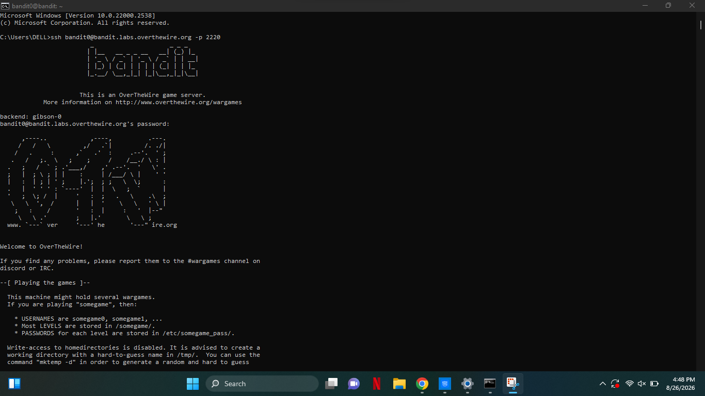
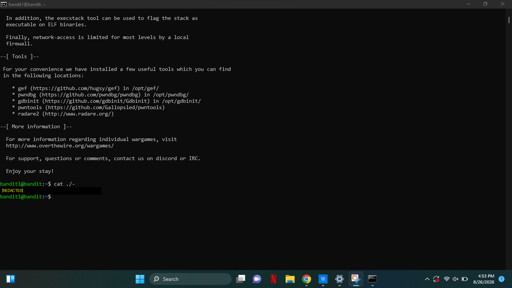
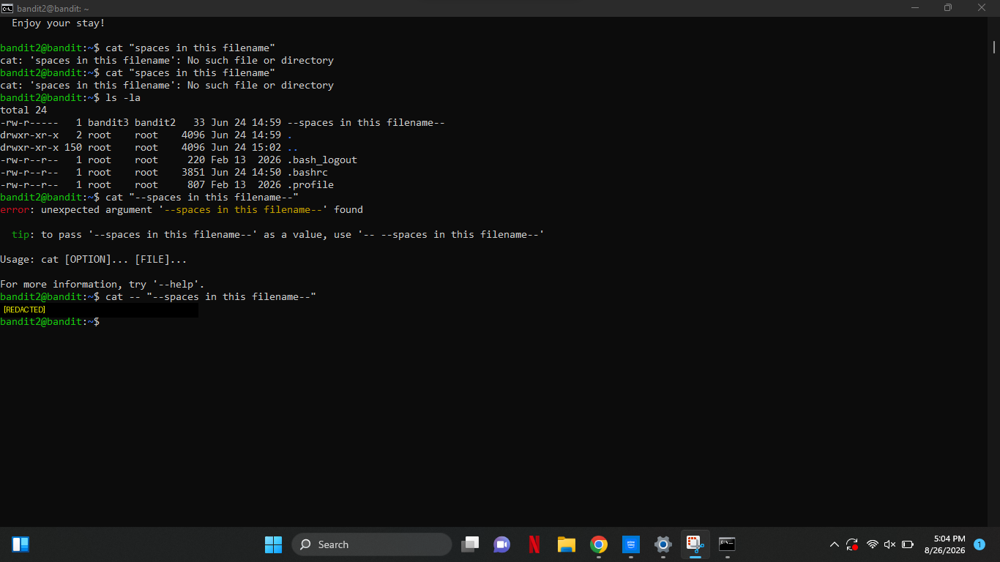
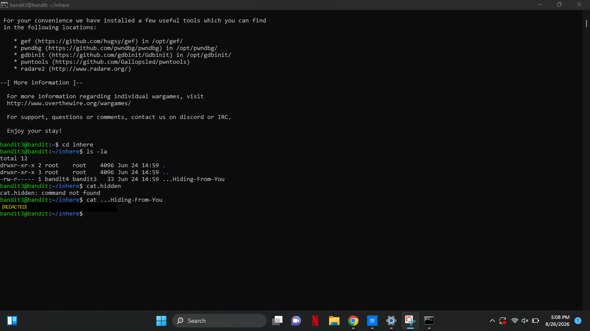
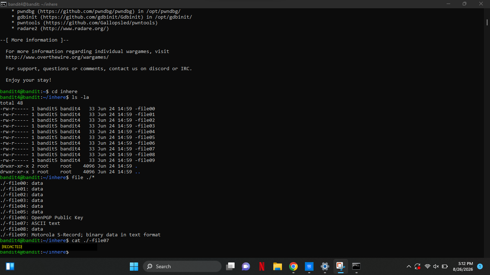
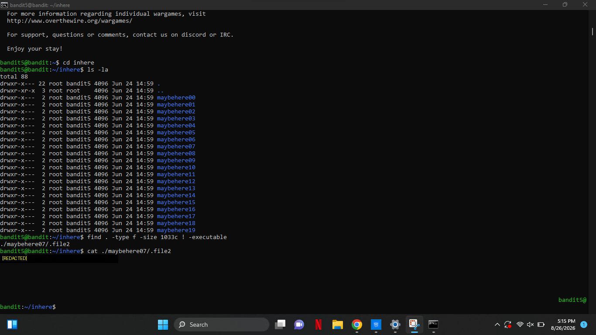

# Bandit Wargame — Levels 0 to 5

**Intern:** Abdullah Khan
**Domain:** Cyber Security
**Program:** DATANEX Internship — Week 2 Task
**Challenge:** [OverTheWire: Bandit](https://overthewire.org/wargames/bandit/)

## Overview

This repository documents my completion of Bandit Levels 0 through 5, an
introductory wargame for practicing Linux command-line and SSH fundamentals —
core skills for cyber security work. Each level requires connecting to a
remote server over SSH and using basic commands to locate a password hidden
somewhere in the filesystem, which becomes the login credential for the next
level.

> **Note on passwords:** In line with OverTheWire's rules (*"don't post
> passwords or spoilers"*), all level passwords have been redacted from the
> screenshots in this repository. The commands and terminal output are shown
> in full to demonstrate the process and reasoning.

## Environment

- Client OS: Windows 10
- Access method: SSH (`bandit.labs.overthewire.org`, port `2220`)
- Terminal: Windows Command Prompt (cmd.exe)

## Level Summaries

| Level | Concept | Key Command(s) |
|-------|---------|-----------------|
| 0 → 1 | Basic SSH connection & reading a file | `ls`, `cat readme` |
| 1 → 2 | Filename that looks like a flag (`-`) | `cat ./-` |
| 2 → 3 | Filename starting with `--` (double dash) | `cat -- "--spaces in this filename--"` |
| 3 → 4 | Hidden (dot) files | `ls -la`, `cat ...Hiding-From-You` |
| 4 → 5 | Identifying file type among many candidates | `file ./*`, `cat ./-file07` |
| 5 → 6 | Searching by size + permission attributes | `find . -type f -size 1033c ! -executable` |

### Level 0 — Basic Connection & File Reading
Connected to the server for the first time and read `readme` in the home
directory to retrieve the next password.
```bash
ssh bandit0@bandit.labs.overthewire.org -p 2220
ls
cat readme
```


### Level 1 — Reading a File Named `-`
A filename of a single dash is normally interpreted as an option rather than
a file, so it has to be referenced with a relative path prefix.
```bash
ssh bandit1@bandit.labs.overthewire.org -p 2220
cat ./-
```


### Level 2 — Filename Starting with `--`
The target file, `--spaces in this filename--`, begins with two dashes, so
tools interpret it as an option and throw an "unexpected argument" error.
Using `--` tells `cat` that everything after it is a filename, not a flag.
```bash
ssh bandit2@bandit.labs.overthewire.org -p 2220
ls -la
cat -- "--spaces in this filename--"
```


### Level 3 — Hidden Files
The password file's name began with a dot, so it doesn't show up in a normal
`ls`. The `-a` flag in `ls -la` reveals hidden files.
```bash
ssh bandit3@bandit.labs.overthewire.org -p 2220
cd inhere
ls -la
cat ...Hiding-From-You
```


### Level 4 — Identifying File Type Among Many
Ten similarly named files existed, only one of which was human-readable
plain text. The `file` command inspects the type of every file at once.
```bash
ssh bandit4@bandit.labs.overthewire.org -p 2220
cd inhere
file ./*
cat ./-file07
```


### Level 5 — Searching by File Attributes
Needed a file matching three criteria at once: human-readable, exactly 1033
bytes, and not executable. `find` with combined filters isolates it.
```bash
ssh bandit5@bandit.labs.overthewire.org -p 2220
cd inhere
find . -type f -size 1033c ! -executable
cat ./maybehere07/.file2
```


## Challenges & Learnings

- Each Bandit level is a **separate SSH login as a different user** — after
  finding a password, you must `exit` and reconnect as the next user rather
  than continuing to run commands under the previous session.
- Filenames beginning with `-` or `--` are misread as command flags; `./`
  prefixes or the `--` end-of-options operator fix this.
- `find` supports combining multiple filters (`-type`, `-size`, `!
  -executable`) in a single search, which is far faster than checking files
  manually.

## Full Report

A detailed write-up with front page, methodology, and full screenshots is
included in the DATANEX internship submission (Word/PDF), submitted
separately via the DATANEX Intern Portal.
